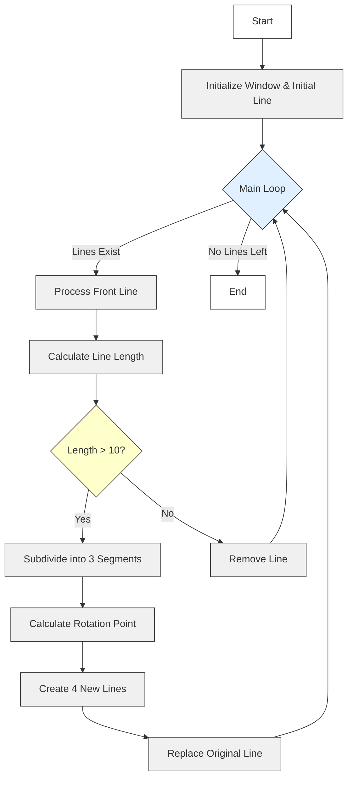

# Koch Curve Fractal Generator


## Description
A C++ implementation of the Koch curve fractal using SFML graphics library. This program demonstrates recursive fractal generation through iterative line subdivision.

## Flow


## Folder Structure
```
KochCurve/
├── CMakeLists.txt
├── KochCurve.png
├── include/
│   └── Line.h
├── src/
│   ├── Line.cpp
│   └── main.cpp
└── build/
```

## Prerequisites
- CMake 3.10+
- SFML 2.5+ (Graphics module)
- C++ compiler (g++/clang++)

## Build Instructions (macOS)
1. Open terminal and navigate to project directory:
```bash
cd Trainning_2025/C++/Fractals/KochCurve
```
2. Create build directory and compile:
```
mkdir -p build && cd build
cmake ..
gmake
```
3. Run the executable:
```
./KochCurve
```
## Key Features 

- Interactive fractal generation
- Recursive line subdivision algorithm
- SFML-based graphical rendering
- Adjustable iteration depth
     

## Controls 

- The program runs automatically
- Close the window to exit
     